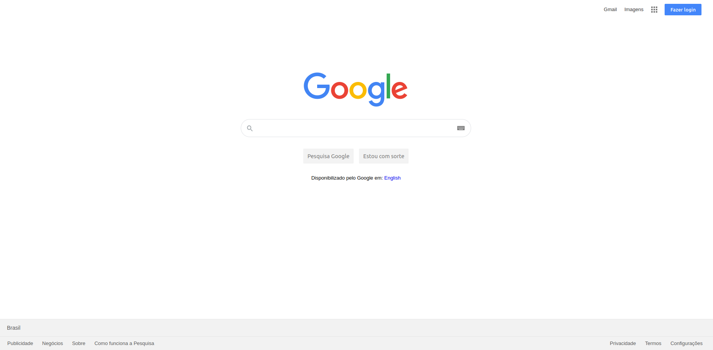

# Google - Página de Busca

Este é um projeto feito com propósito acadêmico.

Estou pegando algumas páginas de sites populares e tentando fazer uma cópia deles usando apenas linguagens Front-End, como HTML, CSS, Javascript.

Para aqueles que estão aprendendo ou que desejam melhoras suas habilidades em Front, eu **recomendo tentar fazer o mesmo**.

Sintam-se livres para fazer o download o código para consulta ou para torná-lo ainda melhor do que já está.

Preview:

# Google - Search Page

This is a project made with scholar purpose.

I'm coding some diferent pages from popular websites and trying to make a copy of them using just Front-End languages, like HTML, CSS, Javascript.

For those who wants to learn or improve your skills, **I strongly recomend** for you to do the same.

Feel free to download the source code for consulting or if you want, to make it even better.
